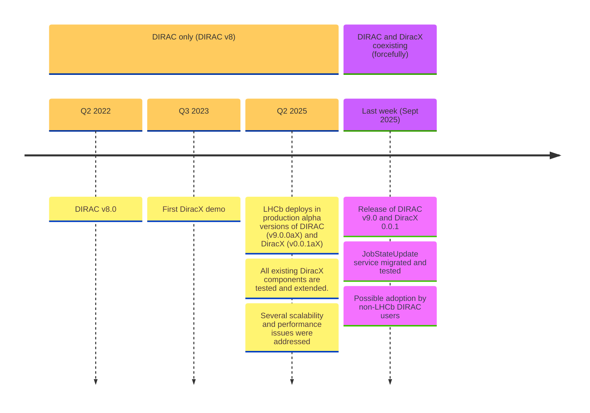
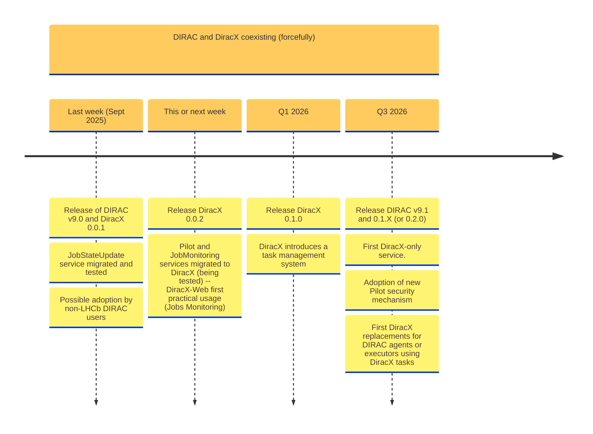
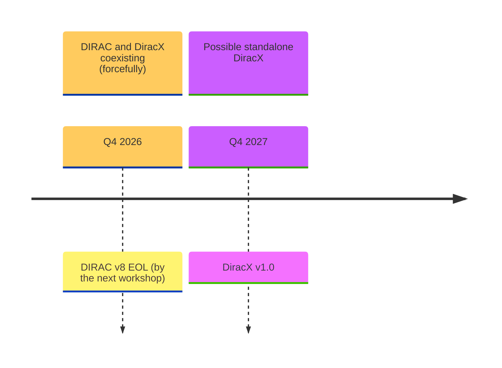
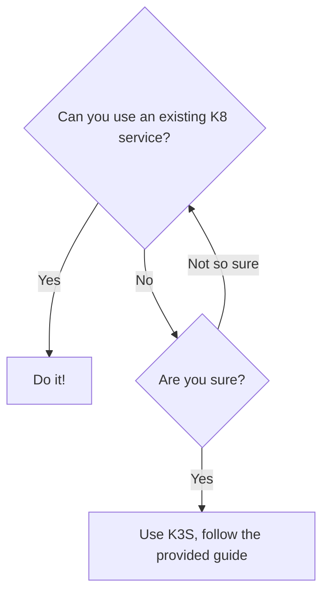

# DIRAC+X status

**Federico Stagni** <Email v="federico.stagni@cern.ch" />

September 17th 2025
__ <a href="https://indico.cern.ch/e/duw11" class="ns-c-iconlink"><mdi-open-in-new />The 11th DIRAC Users' Workshop</a>  


---
layout: section 
color: lime-light
---

<div style="display: flex; align-items: center; justify-content: center;">
    
    <span style="margin: 0 50px;">--></span>
    
</div>

---
layout: top-title-two-cols
color: gray-light
align: c-lt-lm
title: summary
---

:: title ::

# Extreme summary of what happened since the last workshop

:: left ::



:: right ::

(a somewhat personal take)

- We kept doing 2-days hackathons every quarter
  - if not during workshops, at CERN, and with good participation
- DIRAC v8 kept receiving updates, but most of them were "for DiracX" 
- In April 2025 LHCb moved the production setup to DIRAC v9 and DiracX 0.0.1 alpha versions
- We kept postponing "real" releases for excellent technical reasons, until last week, when we tagged the first non-alpha versions of v9 and DiracX


---
layout: top-title-two-cols
color: gray-light
align: c-lm-lm
title: DiracX v0.0.1
columns: is-8
---

:: title ::

# Getting to **DiracX 0.0.1**

:: left ::

## This first release contains:
* All service/client underpinnings
* Extension support
* Jobs sandboxes can be stored in an object store (and you should do it)
* The DIRAC `WorkloadManagement/JobStateUpdateHandler` service can be replaced by an "equivalent" DiracX service
* The helm chart is considered "stable enough"
* Documentation "sufficiently complete"

We will keep working, within the patches of this first version, on adding new services and documentation.


:: right ::

## DiracX brings a new "mindset":
* a cloud-native app
* from "in-house" to "standing-on-the-shoulders"


---
layout: top-title-two-cols
color: gray-light
align: c-lm-lm
title: Timeline
columns: is-8
---

:: title ::

# Timeline of the next year

:: left ::



:: right ::

- There are developments done by stagiare that could not be included in DiracX's first release
- DiracX 0.1.0 will bring "tasks", for replacing DIRAC's *agents*, *executors*, and the RMS machinery (the *RequestExecutingAgent*)
- We will need a DIRAC v9.1 because there will be database changes (some PRs already in *draft*)


---
layout: top-title-two-cols
color: gray-light
align: c-lm-lm
title: Timeline-long
---

:: title ::

# Standalone DiracX will take at least 2 years from now

:: left ::



<SpeechBubble position="l" color='amber' shape="round"  v-drag="[330,125,160,180]">
NB: **very** indicative guess, maybe not for everyone (e.g. not for LHCb).
</SpeechBubble>


:: right :: 

## **notes**

- Dear friends administrator of DIRAC's installations, you have one year to migrate to DiracX
- There's a lot of guesswork in understanding how things will be in one year time, and even more in what will happen after
- This community **needs** to work together as much as possible


---
layout: top-title
color: gray-light
align: c
title: roadmap
---

:: title ::

# The long road to DiracX v1


:: content ::

After **DiracX 0.1.0** (the one bringing *tasks* to DiracX, coming **Q1 2026**) there are many areas that will be "free to proceed" ([roadmap](https://diracx.diracgrid.org/en/latest/roadmap/)), in parallel:

<ul class="text-sm">
  <li>WMS
    <ul>
      <li>Pilots machinery (in DIRAC terms: SiteDirectors, Matcher)
        <ul>
          <li>this needs to include "Computing Resources"</li>
        </ul>
      </li>
      <li>Jobs description (adoption of CWL)</li>
    </ul>
  </li>
  <li>DMS (effectively needed for WMS to work)
    <ul>
      <li>this needs to include "Storage Resources" and "Catalog Resources"
        <ul>
          <li>DiracX to Rucio bridge</li>
        </ul>
      </li>
    </ul>
  </li>
  <li>RSS (effectively needed for WMS to work)</li>
  <li>RMS</li>
  <li>TS (also CWL)
    <ul>
      <li>DIRAC also provides a generic Production System</li>
    </ul>
  </li>
  <li>Accounting and Monitoring</li>
</ul>

<ul class="text-sm">
  <li>Caveats:
    <ul>
      <li>moving a DIRAC service to a DiracX one</li>
    </ul>
  </li>
</ul>


<SpeechBubble position="l" color='amber' shape="round"  v-drag="[680,185,160,180]">
We need your help on pretty much all these topics
</SpeechBubble>


---
layout: section
color: cyan-light
title: toV9
---

# From DIRAC v8 to v9+0.0.1


---
layout: top-title
color: gray-light
align: c
title: Users-WhatsNew
---

:: title :: 

# What's new 

:: content ::

DiracX brings updates for

- Users
- Administrators
- Developers

As of now:
- we are more concerned about solving **administrator**'s issues.
- **Developers** "need to know" already if you have an DIRAC (or WebAppDIRAC) extension.
- **Users** "do not yet need to know".


---
layout: section
color: cyan
title: toV9-users
---

# From DIRAC v8 to v9+0.0.1 : **Users**

---
layout: top-title
color: gray-light
align: c
title: Users-WhatsNew
---

:: title :: 

# What's new for users

:: content ::

<ul class="text-sm">
  <li><strong>Logging-in</strong> requires that you are previously registered in an IdP implementing OpenID Connect protocol
    <ul>
      <li>essentially this is the VOMS-&gt;IaM migration. Admins should have done this already, transparently, for all the users of a VO</li>
      <li>if a VO is not migrated to IaM, it can't be "enabled" (see later on)</li>
    </ul>
  </li>
  <li>New <strong>Web app</strong> (which, for DiracX 0.1 will not be of much use)</li>
  <li>Enriched and modern <strong>CLI</strong> (but not many functionalities in there)</li>
  <li><strong>REST</strong> interface for programmatic usage (for advanced users -- but again, not much user-facing info to use)</li>
</ul>

<p>But effectively, for now <strong>users can largely be agnostic</strong> of DiracX, as for the first version users' interactions will still be done via the DIRAC tools they know (and love?).</p>

<p>Also, users should be setting the correct environment variables (<code>DIRACX_URL</code> mostly)</p>

<ul class="text-sm">
  <li>admins should be setting it already for the users</li>
</ul>

---
layout: top-title
color: gray-light
align: c
title: CLI
---

:: title ::

# CLI Interactions

:: content ::

1. Logging in (using the `diracx cli`):

```bash
❯ dirac login gridpp
Logging in with scopes: ['vo:gridpp']
Now go to: https://diracx-cert.app.cern.ch/api/auth/device?user_code=XYZXYZXYZ
...Saved credentials to /home/fstagni/.cache/diracx/credentials.json
Login successful!
```

2. Submitting a job (using Python `requests`):

```python
import requests

requests.post('https://diracx-cert.app.cern.ch/api/jobs/', headers={'accept': 'application/json', 'Authorization': 'Bearer eyJhbG...', 'Content-Type': 'application/json'}, json=jdl)
```

3. Getting its status (using `curl`):

````md magic-move
```bash
curl -X 'GET' \
  'https://diracx-cert.app.cern.ch/api/jobs/status?job_ids=8971' \
  -H 'accept: application/json' \
  -H 'Authorization: Bearer eyJhbG...'  | jq
```
```json
{
  "8971": {
    "Status": "Done",
    "MinorStatus": "Execution Complete",
    "ApplicationStatus": "Unknown"
  }
}
```
````

---
layout: section
color: cyan
title: toV9-administrator
---

# From DIRAC v8 to v9+0.0.1 : **Administrators**


---
layout: side-title
color: gray-light
title: Externals
align: cm-lm
titlewidth: is-2
---


:: title ::

# Tools

:: content ::

Architecturally, you can't run DiracX without:
<ul class="text-sm">
  <li>MySQL (or MariaDB) (this you always had -- no need to touch it)
    <ul>
      <li>DiracX 0.0.1 has only one new DB <code>DiracXAuthDB</code> (containing tokens)</li>
      <li><em>NOTE</em>: we tried to use PostgreSQL as an alternative to MySQL, and failed because of "data format" issues, and won't retry in the near future.</li>
    </ul>
  </li>
  <li>OpenSearch (you <em>should</em> have it already)</li>
  <li>Kubernetes (<strong>NEW</strong>)</li>
  <li>S3-compatible object store (<strong>NEW</strong>)</li>
  <li>a Grafana instance (not immediately, but will be needed)</li>
  <li>OTEL (not immediately, but maybe you will want to have it)</li>
</ul>

so, make sure the above are up and running as-a-service.

<AdmonitionType type="important" width="700px">
The central team can not fully help in setting up any of the above. 
We nevertheless provide a K8 setup guide, and we can give few specific advices - ask us these days!
</AdmonitionType>

---
layout: iframe-left
color: gray-light
title: k8
url: https://diracx.diracgrid.org/en/latest/admin/how-to/install/install-kubernetes/
---

# On Kubernetes <devicon-kubernetes class="text-3xl align-middle inline-block mx-0"></devicon-kubernetes>



<AdmonitionType type="info" width="400px">
You do not really need to have K3S on more than one node (if that's "beefy")
</AdmonitionType>


---
layout: top-title
color: red-light
align: c
title: admins-notes
---

:: title ::

# Personal suggestion

:: content ::


<div style="
  background-color: #fdf6e3;
  border: 2px solid #8b5a2b;
  border-radius: 12px;
  padding: 20px;
  font-family: 'Papyrus', 'Times New Roman', serif;
  font-size: 1.1em;
  line-height: 1.6;
  color: #3b2f2f;
  max-width: 800px;
  margin: 20px auto;
  box-shadow: 0 0 20px rgba(0,0,0,0.3);
  background-image: radial-gradient(circle at top left, #fff8dc, #f5deb3);
">
  <h2 style="text-align:center; font-family: 'Papyrus', serif; font-size: 1.5em; margin-bottom: 15px;">
    ✒ My very personal suggestion ✒
  </h2>
  <p>
    Dear friends, admins of DIRAC installations,
  </p>
  <p>
    By these humble words I address thee, as was the custom in times of old.
    You are not there to bother yourself with K3S or MinIO,
    or other infrastructure stuff.
    

    So, 
    
    -> DO use "services".
    -> DO get together, join forces!

    Can some of the institute part of your international collaboration
    host DiracX services? 
    Maybe CERN ?

  </p>
  <p style="text-align:right; margin-top:30px;">
    With love and affection<br>
  </p>
</div>


---
layout: top-title-two-cols
color: gray-light
align: c-lm-lm
title: chart
---

:: title :: 

# Helm <devicon-helm class="text-3xl align-middle inline-block mx-0"></devicon-helm>

:: left ::

<ul class="text-sm">
  <li><a href="https://github.com/DIRACGrid/diracx-charts">DiracX Helm chart</a>
  </li>
  <li>Used for:
    <ul>
      <li>DiracX testing (GitHub actions)</li>
      <li>Local development instance</li>
      <li>Running a demo instance</li>
      <li>Running test and productions instances</li>
    </ul>
  </li>
</ul>

Unique pointer for charts: https://charts.diracgrid.org/index.yaml

:: right ::


<AdmonitionType type="info" width="300px">
The helm charts provide **everything**, including MySQL and Opensearch, and iam. 
This is intended for local development, not for production.
</AdmonitionType>


---
layout: top-title
color: gray-light
align: c
title: v9-migration
---

:: title ::

# What is in practice needed to migrate to v9?

:: content ::

Use this [skeleton](https://codimd.web.cern.ch/5C44tUJTReacVOcIn_0Bfg#)


---
layout: top-title
color: gray-light
align: c
title: CS
---

:: title ::

### CS changes

:: content ::

- IdP
- Legacy adaptors


---
layout: section
color: cyan
title: toV9-developer
---

# From DIRAC v8 to v9+0.0.1 : Developers

---
layout: top-title
color: gray-light
align: c
title: DevX
---

:: title ::

# On developing DiracX

:: content ::

Reminders:
- sqlalchemy
- fastapi for the services
- click (?) and rich for the CLI

- pixi


---
layout: top-title
color: gray-light
align: c
title: TestX
---

:: title ::

# Testing DiracX

:: content ::

Even if Github CIs will do every "everything", if you want to run integration tests for DiracX locally, you can:

- Run a local `uvicorn` server with default configuration: (???? works??)

```sh
git clone https://github.com/DIRACGrid/diracx
cd diracx
mamba create --name my-diracx-env
conda activate my-diracx-env
pip install requirements-dev.txt
./run_local.sh
```

SQL DBs are in `SQLite` (no similar option for OpenSearch, so still using sqlite).

&nbsp;
&nbsp;

**Run the demo**

```sh
git clone https://github.com/DIRACGrid/diracx-charts
./diracx-charts/run_demo.sh # this is run for each and every commit in Github Actions
pytest --demo-dir=../diracx-charts/
```

---
layout: top-title
color: gray-light
align: c
title: FutureExtensions
---

:: title ::

# DiracX extensions

:: content ::

<span class="bg-cyan-100 text-cyan-600 text-center p-4 border-l-6 border-2 border-cyan-400 rounded-lg pl-8 pr-8 w-full block">
    By now, we know that it is sometimes necessary to extend all Dirac(X) components 
    
    DiracX aims to provide an easy way to do so.
</span>


```toml
# entrypoints in pyproject.toml

[project.entry-points."diracx.db.sql"]
AuthDB = "diracx.db.sql:AuthDB"
JobDB = "<extension>.db.sql:ExtendedJobDB"
```

<SpeechBubble position="t" color='amber' shape="round"  v-drag="[400,310,220,140]">
For DiracX and DiracX-Web we already provide reference extensions
</SpeechBubble>


---
layout: section
color: cyan-light
title: Demos
---

# Demonstrations


---
layout: iframe-right
title: Web API
url: https://diracx-cert.app.cern.ch/api/docs
class: webAPI
slide_info: false
color: gray-light
align: lm
---

# DiracX Web API

<AdmonitionType type='caution' >
What is on the right is the certification Web API (VOs: `dteam` and `gridpp`), loaded live. Use with caution!
</AdmonitionType>

DIRAC Web APIs with <devicon-fastapi-wordmark class="text-7xl align-middle inline-block mx-0"></devicon-fastapi-wordmark>

<ul class="text-sm">
  <li>
    Nicely documented by 
    <devicon-swagger-wordmark class="text-7xl align-middle inline-block mx-0"></devicon-swagger-wordmark>
    <ul class="text-xs ml-4">
      <li class="text-xs">--> this is what you see on the right</li>
    </ul>
  </li>
  <li>
    Follows the <devicon-plain-openapi-wordmark class="text-7xl align-middle inline-block mx-1"></devicon-plain-openapi-wordmark> specification, with the (python) client generated by <a href="https://github.com/Azure/autorest/blob/main/docs/introduction.md">AutoREST</a>.
  </li>
</ul>


<!-- 
- there is also redoc
- AutoREST supports several langagues, not only python
-->


---
layout: iframe-left
title: WebApp
url: https://diracx-cert.app.cern.ch
class: webapp
slide_info: false
color: gray-light
align: lm
---

# DiracX web

We are also rewriting [the Web App](https://github.com/DIRACGrid/diracx-web) from scratch.

Software stack:
- NextJS <devicon-nextjs-wordmark class="text-4xl align-middle inline-block mx-2" />
- Material UI <devicon-materialui class="text-3xl align-middle inline-block mx-2" />
- TypeScript <devicon-typescript class="text-3xl align-middle inline-block mx-2" />

<AdmonitionType type='caution' >
What is on the left is the certification WebApp, loaded live. Use with caution!
</AdmonitionType>


---
layout: section
color: cyan-light
title: Conclusions
---

# To conclude

---
layout: side-title
color: gray-light
title: Contribute
align: cm-lm
titlewidth: is-3
---

:: title ::

# *"I want to contribute"*

:: content ::

## The obvious ways:

<ul class="text-sm">
    <li>
        <a href="https://github.com/DIRACGrid/diracx" class="text-blue-600 hover:underline">code (github.com/DIRACGrid)</a>
    </li>
    <li>
        tests: (as you could see we have a somewhat open test deployment infrastructure). Try something out, and let us know!
    </li>
</ul>

**Run the demo (on your laptop):**

```sh
git clone https://github.com/DIRACGrid/diracx-charts
diracx-charts/run_demo.sh # this is run for each and every commit in Github Actions
```
 

## Discuss:
<ul class="text-sm">
  <li><strong>mattermost</strong>: <a href="https://mattermost.web.cern.ch/diracx/" class="text-blue-600 hover:underline">https://mattermost.web.cern.ch/diracx/</a></li>
  <li><strong>meetings</strong>: (almost) every week on Thursday morning (CET)</li>
  <li><strong>hackathons</strong>: we have been doing 2-days DiracX hackathons every quarter, at CERN
    <ul class="text-xs ml-4">
      <li>--> <a href="https://indico.cern.ch/event/1582395/" class="text-blue-600 hover:underline">Next will be 13th-14th January 2026</a></li>
    </ul>
  </li>
  <li><strong>workshops</strong>: once per year, more or less
    <ul class="text-xs ml-4">
      <li>--> <a href="https://indico.cern.ch/event/1433941/" class="text-blue-600 hover:underline">Next one in 2026, in "To be disclosed"</a></li>
    </ul>
  </li>
</ul>


---
layout: top-title-two-cols
align: cm-cm-lm
color: orange-light
columns: is-4
title: summary
--- 
:: title ::

# Summary

:: left :: 

 </img>

:: right ::

<ul class="text-base">
  <li>DiracX, "the neXt Dirac incarnation", is here!
  </li>
</ul>


---
layout: credits
color: navy
loop: true
speed: 1.0
title: credits/people
---


<div class="grid text-size-4 grid-cols-3 w-3/4 gap-y-10 auto-rows-min ml-auto mr-auto">
    <div class="grid-item text-center mr-0- col-span-3">
        <strong>People</strong><br> 
    </div>
    <div class="grid-item text-right mr-4 col-span-1">
        <strong>Current Developers, maintainers, supporters</strong>
    </div>
    <div class="grid-item col-span-2">
        Chris Burr <i>CERN, LHCb</i><br/>
        Christophe Haen <i>CERN, LHCb</i><br/>
        Alexandre Boyer <i>CERN, LHCb</i><br/>
        Natthan Piggoux <i>LUPM (FR), CTA</i><br/>
        Cedric Serfon <i>Brookhaven National Laboratory (US), Belle2</i><br/>
        Ryunosuke O'Neil <i>CERN, LHCb</i><br/>
        Daniela Bauer <i>Imperial college (UK), GridPP</i><br/>
        Simon Fayer <i>Imperial college (UK), GridPP</i><br/>
        Janusz Martyniak <i>Imperial college (UK), GridPP</i><br/>
        Xiaomei Zhang <i>Beijing, Inst. High Energy Phys. (CN), Juno</i><br/>
        Luisa Arrabito <i>LUPM (FR), CTA</i><br/>
        André Sailer <i>CERN</i><br/>
        Jorge Lisa Laborda <i>Univ. of Valencia and CSIC (ES), LHCb</i><br/>
        Bertrand Rigaud <i>IN2P3 (FR)</i>
    </div>
    <div class="grid-item text-right mr-4 col-span-1">
        <strong>Project lead</strong>
    </div>
    <div class="grid-item col-span-2">
        Federico Stagni <i>CERN, LHCb</i><br/>
        Andrei Tsaregorotsev <i>CPPM (FR), EGI and LHCb</i>
    </div>
</div>

&nbsp;
&nbsp;
&nbsp;

<div class="grid-item col-span-3 text-center mt-180px mb-auto font-size-1.5rem">
    <strong>Questions?</strong>
</div>

---
layout: section
color: cyan-light
title: Backup
---

# Backup
