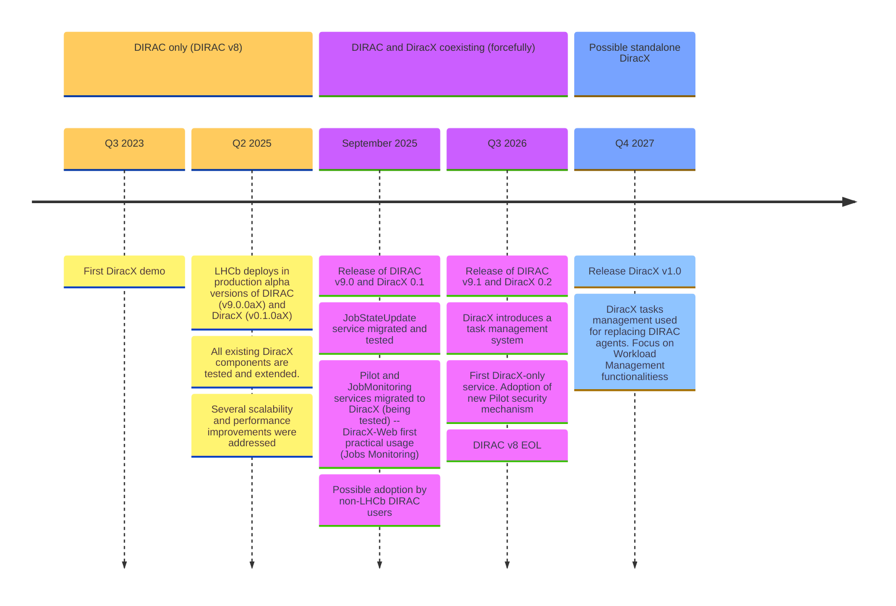

# DIRAC+X status

**Federico Stagni** <Email v="federico.stagni@cern.ch" />

September 17th 2025
__ <a href="https://indico.cern.ch/e/duw11" class="ns-c-iconlink"><mdi-open-in-new />The 11th DIRAC Users' Workshop</a>  


---
layout: section 
color: lime-light
---

<div style="display: flex; align-items: center; justify-content: center;">
    
    <span style="margin: 0 50px;">--></span>
    
</div>


---
layout: top-title
color: gray-light
align: c
title: Timeline
---

:: title ::

# Timeline

:: content ::



---
layout: top-title-two-cols
color: gray-light
align: c-lm-lm
title: DiracX v0.1.0
---

:: title ::

# Getting to **DiracX 0.1.0**

:: left ::

This first release contains:
* All service/client underpinnings
* Extension support
* Sandboxes in the object store
* JobStateUpdateHandler can be replaced by DiracX
* "Stable" helm chart
* Documentation sufficiently complete

:: right ::

Apart from the many technical details, DiracX brings with it a new "mindset":
* a cloud-native app
* from "in-house" to "standing-on-the-shoulders"


---
layout: section
color: cyan-light
title: toV9
---

# From DIRAC v8 to v9+0.1.0

---
layout: side-title
color: gray-light
title: Architecture
align: cm-lm
titlewidth: is-3
---


:: title ::

# Architecture diagram

:: content ::

 </img>

---
layout: section
color: cyan
title: toV9-users
---

# From DIRAC v8 to v9+0.1.0 : Users

---
layout: top-title
color: gray-light
align: c
title: Users-WhatsNew
---

:: title :: 

# What's new for users

:: content ::

- **Logging-in** requires that you are previously registered in an IdP (your admins should have done this for you -- essentially from VOMS)
- New **Web app**
- Enriched and modern **CLI**
- **REST** interface for programmatic usage

But effectively, for now **users can largely be agnostic** of DiracX, as for the first version users' interactions will still be done via the DIRAC tools they know (and love?)

Users' env variables (`DIRACX_URL`)

---
layout: top-title
color: gray-light
align: c
title: CLI
---

:: title ::

# CLI Interactions

:: content ::

1. Logging in (using the `diracx cli`):

```bash
❯ dirac login gridpp
Logging in with scopes: ['vo:gridpp']
Now go to: https://diracx-cert.app.cern.ch/api/auth/device?user_code=XYZXYZXYZ
...Saved credentials to /home/fstagni/.cache/diracx/credentials.json
Login successful!
```

2. Submitting a job (using Python `requests`):

```python
import requests

requests.post('https://diracx-cert.app.cern.ch/api/jobs/', headers={'accept': 'application/json', 'Authorization': 'Bearer eyJhbG...', 'Content-Type': 'application/json'}, json=jdl)
```

3. Getting its status (using `curl`):

````md magic-move
```bash
curl -X 'GET' \
  'https://diracx-cert.app.cern.ch/api/jobs/status?job_ids=8971' \
  -H 'accept: application/json' \
  -H 'Authorization: Bearer eyJhbG...'  | jq
```
```json
{
  "8971": {
    "Status": "Done",
    "MinorStatus": "Execution Complete",
    "ApplicationStatus": "Unknown"
  }
}
```
````

---
layout: section
color: cyan
title: toV9-administrator
---

# From DIRAC v8 to v9+0.1.0 : Administrators


---
layout: side-title
color: gray-light
title: Externals
align: cm-lm
titlewidth: is-3
---


:: title ::

# Tools

:: content ::

Architecturally, you can't run DiracX without:
* MySQL (this you always had -- no need to touch it)
* OpenSearch (you *should* have it already)
* Kubernetes (**NEW**)
* S3-compatible object store (**NEW**)

so, make sure the above are up and running as-a-service.


---
layout: top-title-two-cols
color: gray-light
align: c-lm-lm
title: Deployments
---

:: title :: 

# DiracX is deployed on Kubernetes

:: left ::

Kubernetes - <devicon-kubernetes class="text-3xl align-middle inline-block mx-0"></devicon-kubernetes> Standard to define a distributed system

<ul class="text-sm">
  <li>Separates infrastructure from applications
    <ul>
      <li class="text-xs">"Please IT department(/cloud provider) run this for me"</li>
    </ul>
  </li>
</ul>


Helm <devicon-helm class="text-3xl align-middle inline-block mx-0"></devicon-helm> gives the ability:

<ul class="text-sm">
  <li>to parameterise</li>
  <li>to distribute a kubernetes config</li>
</ul>

:: right ::

<ul class="text-sm">
  <li><a href="https://github.com/DIRACGrid/diracx-charts">DiracX Helm chart</a>
    <ul>
      <li>If your institution provides a kubernetes service: use it</li>
      <li>If you work with public clouds: use their container services</li>
      <li>Alternatively, follow these <a href="https://github.com/DIRACGrid/diracx-charts/tree/master/k3s">k3s instructions</a></li>
    </ul>
  </li>
  <li>Used for:
    <ul>
      <li>DiracX testing (GitHub actions)</li>
      <li>Local development instance</li>
      <li>Running a demo instance</li>
      <li>Running test and productions instances</li>
    </ul>
  </li>
</ul>


<StickyNote color="gray-light" textAlign="center" width="260px" title="What to run on K8" v-drag="[175,430,600,100]">
The helm charts provide "everything", including MySQL and Opensearch. You are in no obligation to run all available services on K8 -- and you shouldn't!
</StickyNote>


---
layout: top-title
color: gray-light
align: c
title: v9-migration
---

:: title ::

# What is in practice needed to migrate to v9?

:: content ::

Use this [skeleton](https://codimd.web.cern.ch/5C44tUJTReacVOcIn_0Bfg#), but first of all:

- You need an IdP (IAM...) -- you probably already have one instance!
  - Probably one for every VO you host (?)
- Register a DiracX `client` in the IdP, will be needed in order for DiracX (server) to authenticate
- if you have a VODIRAC extension:
  - update it considering the many changes.
  - code an "empty" `vodiracx` extension
- if you have a WebAppDIRAC extension:
  - code an "empty" `vodiracx-web` extension
- have a k8 project ready for hosting (vo)diracx
- have a S3 storage ready for storing sandboxes
- deploy (vo)diracx 


---
layout: top-title
color: gray-light
align: c
title: CS
---

:: title ::

### CS changes

:: content ::

- IdP
- Legacy adaptors


---
layout: section
color: cyan
title: toV9-developer
---

# From DIRAC v8 to v9+0.1.0 : Developers


---
layout: top-title
color: gray-light
align: c
title: FutureExtensions
---

:: title ::

# DiracX extensions

:: content ::

<span class="bg-cyan-100 text-cyan-600 text-center p-4 border-l-6 border-2 border-cyan-400 rounded-lg pl-8 pr-8 w-full block">
    By now, we know that it is sometimes necessary to extend all Dirac(X) components 
    
    DiracX aims to provide an easy way to do so.
</span>


```toml
# entrypoints in pyproject.toml

[project.entry-points."diracx.db.sql"]
AuthDB = "diracx.db.sql:AuthDB"
JobDB = "<extension>.db.sql:ExtendedJobDB"
```

<SpeechBubble position="t" color='amber' shape="round"  v-drag="[400,310,220,140]">
For DiracX and DiracX-Web we already provide reference extensions
</SpeechBubble>


---
layout: section
color: cyan-light
title: Demos
---

# Demonstrations


---
layout: iframe-right
title: Web API
url: https://diracx-cert.app.cern.ch/api/docs
class: webAPI
slide_info: false
color: gray-light
align: lm
---

# DiracX Web API

<AdmonitionType type='caution' >
What is on the right is the certification Web API (VOs: `dteam` and `gridpp`), loaded live. Use with caution!
</AdmonitionType>

DIRAC Web APIs with <devicon-fastapi-wordmark class="text-7xl align-middle inline-block mx-0"></devicon-fastapi-wordmark>

<ul class="text-sm">
  <li>
    Nicely documented by 
    <devicon-swagger-wordmark class="text-7xl align-middle inline-block mx-0"></devicon-swagger-wordmark>
    <ul class="text-xs ml-4">
      <li class="text-xs">--> this is what you see on the right</li>
    </ul>
  </li>
  <li>
    Follows the <devicon-plain-openapi-wordmark class="text-7xl align-middle inline-block mx-1"></devicon-plain-openapi-wordmark> specification, with the (python) client generated by <a href="https://github.com/Azure/autorest/blob/main/docs/introduction.md">AutoREST</a>.
  </li>
</ul>


<!-- 
- there is also redoc
- AutoREST supports several langagues, not only python
-->


---
layout: iframe-left
title: WebApp
url: https://diracx-cert.app.cern.ch
class: webapp
slide_info: false
color: gray-light
align: lm
---

# DiracX web

We are also rewriting [the Web App](https://github.com/DIRACGrid/diracx-web) from scratch.

Software stack:
- NextJS <devicon-nextjs-wordmark class="text-4xl align-middle inline-block mx-2" />
- Material UI <devicon-materialui class="text-3xl align-middle inline-block mx-2" />
- TypeScript <devicon-typescript class="text-3xl align-middle inline-block mx-2" />

<AdmonitionType type='caution' >
What is on the left is the certification WebApp, loaded live. Use with caution!
</AdmonitionType>

---
layout: top-title
color: gray-light
align: c
title: LHCb
---

:: title ::

# LHCbDIRAC and LHCbDiracX

:: content ::

# show extensions "live"

---
layout: section
color: cyan-light
title: Conclusions
---

# To conclude

---
layout: side-title
color: gray-light
title: Contribute
align: cm-lm
titlewidth: is-3
---

:: title ::

# *"I want to contribute"*

:: content ::

## The obvious ways:

<ul class="text-sm">
    <li>
        <a href="https://github.com/DIRACGrid/diracx" class="text-blue-600 hover:underline">code (github.com/DIRACGrid)</a>
    </li>
    <li>
        tests: (as you could see we have a somewhat open test deployment infrastructure). Try something out, and let us know!
    </li>
</ul>

**Run the demo (on your laptop):**

```sh
git clone https://github.com/DIRACGrid/diracx-charts
diracx-charts/run_demo.sh # this is run for each and every commit in Github Actions
```
 

## Discuss:
<ul class="text-sm">
  <li><strong>mattermost</strong>: <a href="https://mattermost.web.cern.ch/diracx/" class="text-blue-600 hover:underline">https://mattermost.web.cern.ch/diracx/</a></li>
  <li><strong>meetings</strong>: (almost) every week on Thursday morning (CET)</li>
  <li><strong>hackathons</strong>: we have been doing 2-days DiracX hackathons every quarter, at CERN
    <ul class="text-xs ml-4">
      <li>--> <a href="https://indico.cern.ch/event/1582395/" class="text-blue-600 hover:underline">Next will be 13th-14th January 2026</a></li>
    </ul>
  </li>
  <li><strong>workshops</strong>: once per year, more or less
    <ul class="text-xs ml-4">
      <li>--> <a href="https://indico.cern.ch/event/1433941/" class="text-blue-600 hover:underline">Next one in 2026, in "To be disclosed"</a></li>
    </ul>
  </li>
</ul>


---
layout: top-title-two-cols
align: cm-cm-lm
color: orange-light
columns: is-4
title: summary
--- 
:: title ::

# Summary

:: left :: 

 </img>

:: right ::

<ul class="text-base">
  <li>DiracX, "the neXt Dirac incarnation", is here!
  </li>
</ul>


---
layout: credits
color: navy
loop: true
speed: 1.0
title: credits/people
---


<div class="grid text-size-4 grid-cols-3 w-3/4 gap-y-10 auto-rows-min ml-auto mr-auto">
    <div class="grid-item text-center mr-0- col-span-3">
        <strong>People</strong><br> 
    </div>
    <div class="grid-item text-right mr-4 col-span-1">
        <strong>Current Developers, maintainers, supporters</strong>
    </div>
    <div class="grid-item col-span-2">
        Chris Burr <i>CERN, LHCb</i><br/>
        Christophe Haen <i>CERN, LHCb</i><br/>
        Alexandre Boyer <i>CERN, LHCb</i><br/>
        Natthan Piggoux <i>LUPM (FR), CTA</i><br/>
        Cedric Serfon <i>Brookhaven National Laboratory (US), Belle2</i><br/>
        Ryunosuke O'Neil <i>CERN, LHCb</i><br/>
        Daniela Bauer <i>Imperial college (UK), GridPP</i><br/>
        Simon Fayer <i>Imperial college (UK), GridPP</i><br/>
        Janusz Martyniak <i>Imperial college (UK), GridPP</i><br/>
        Xiaomei Zhang <i>Beijing, Inst. High Energy Phys. (CN), Juno</i><br/>
        Luisa Arrabito <i>LUPM (FR), CTA</i><br/>
        André Sailer <i>CERN</i><br/>
        Jorge Lisa Laborda <i>Univ. of Valencia and CSIC (ES), LHCb</i><br/>
        Bertrand Rigaud <i>IN2P3 (FR)</i>
    </div>
    <div class="grid-item text-right mr-4 col-span-1">
        <strong>Project lead</strong>
    </div>
    <div class="grid-item col-span-2">
        Federico Stagni <i>CERN, LHCb</i><br/>
        Andrei Tsaregorotsev <i>CPPM (FR), EGI and LHCb</i>
    </div>
</div>

&nbsp;
&nbsp;
&nbsp;

<div class="grid-item col-span-3 text-center mt-180px mb-auto font-size-1.5rem">
    <strong>Questions?</strong>
</div>

---
layout: section
color: cyan-light
title: Backup
---

# Backup
